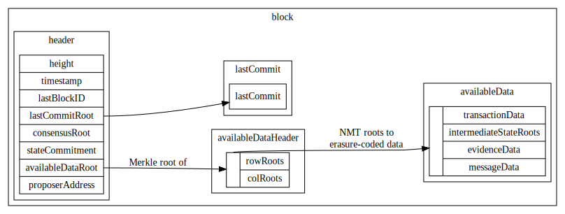
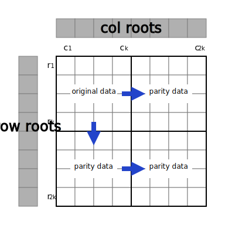
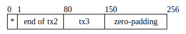

Data Structures
===

- [Data Structures](#data-structures)
- [Data Structures Overview](#data-structures-overview)
- [Blockchain Data Structures](#blockchain-data-structures)
  - [Block](#block)
  - [Header](#header)
  - [AvailableDataHeader](#availabledataheader)
  - [AvailableData](#availabledata)
  - [Commit](#commit)
  - [Time](#time)
  - [BlockID](#blockid)
  - [HashDigest](#hashdigest)
  - [Address](#address)
  - [CommitSig](#commitsig)
  - [Signature](#signature)
- [Serialization](#serialization)
- [Hashing](#hashing)
- [Public-Key Cryptography](#public-key-cryptography)
- [Merkle Trees](#merkle-trees)
  - [Binary Merkle Tree](#binary-merkle-tree)
  - [Annotated Merkle Tree](#annotated-merkle-tree)
    - [Verifying Annotated Merkle Proofs](#verifying-annotated-merkle-proofs)
  - [Namespace Merkle Tree](#namespace-merkle-tree)
  - [Sparse Merkle Tree](#sparse-merkle-tree)
- [Erasure Coding](#erasure-coding)
  - [Reed-Solomon Erasure Coding](#reed-solomon-erasure-coding)
  - [2D Reed-Solomon Encoding Scheme](#2d-reed-solomon-encoding-scheme)
  - [Share](#share)
  - [Arranging Available Data Into Shares](#arranging-available-data-into-shares)
- [Available Data](#available-data)
  - [TransactionData](#transactiondata)
    - [WrappedTransaction](#wrappedtransaction)
    - [Transaction](#transaction)
  - [IntermediateStateRootData](#intermediatestaterootdata)
    - [WrappedIntermediateStateRoot](#wrappedintermediatestateroot)
    - [IntermediateStateRoot](#intermediatestateroot)
  - [EvidenceData](#evidencedata)
    - [Evidence](#evidence)
    - [PublicKey](#publickey)
    - [Vote](#vote)
  - [MessageData](#messagedata)
    - [Message](#message)
- [State](#state)
- [Consensus Parameters](#consensus-parameters)

# Data Structures Overview



# Blockchain Data Structures

## Block

Blocks are the top-level data structure of the LazyLedger blockchain.

| name                  | type                                        | description                                                           |
| --------------------- | ------------------------------------------- | --------------------------------------------------------------------- |
| `header`              | [Header](#header)                           | Block header. Contains primarily identification info and commitments. |
| `availableDataHeader` | [AvailableDataHeader](#availabledataheader) | Header of available data. Contains commitments to erasure-coded data. |
| `availableData`       | [AvailableData](#availabledata)             | Data that is erasure-coded for availability.                          |
| `lastCommit`          | [Commit](#commit)                           | Previous block's Tendermint commit.                                   |

## Header

Block header, which is fully downloaded by both full clients and light clients.

| name                | type                      | description                                                                                  |
| ------------------- | ------------------------- | -------------------------------------------------------------------------------------------- |
| `height`            | `uint64`                  | Block height. The genesis block is at height `1`.                                            |
| `time`              | [Time](#time)             | Timestamp of this block.                                                                     |
| `lastBlockID`       | [BlockID](#blockid)       | Previous block's ID.                                                                         |
| `lastCommitRoot`    | [HashDigest](#hashdigest) | Previous block's Tendermint commit root.                                                     |
| `consensusRoot`     | [HashDigest](#hashdigest) | Merkle root of [consensus parameters](#consensus-parameters) for this block.                 |
| `stateCommitment`   | [HashDigest](#hashdigest) | Commitment to state root and validator set root after this block's transactions are applied. |
| `availableDataRoot` | [HashDigest](#hashdigest) | Root of [commitments to erasure-coded data](#availabledataheader).                           |
| `proposerAddress`   | [Address](#address)       | Address of this block's proposer.                                                            |

## AvailableDataHeader

| name                       | type                          | description                            |
| -------------------------- | ----------------------------- | -------------------------------------- |
| `availableDataCommitments` | [HashDigest](#hashdigest)`[]` | Commitments to all erasure-coded data. |

## AvailableData

Data that is [erasure-coded](#erasure-coding) for [data availability checks](https://arxiv.org/abs/1809.09044).

| name                        | type                                                    | description                                                                                                     |
| --------------------------- | ------------------------------------------------------- | --------------------------------------------------------------------------------------------------------------- |
| `transactionData`           | [TransactionData](#transactiondata)                     | Transaction data. Transactions modify the validator set and balances, and pay fees for messages to be included. |
| `intermediateStateRootData` | [IntermediateStateRootData](#intermediatestaterootdata) | Intermediate state roots used for fraud proofs.                                                                 |
| `evidenceData`              | [EvidenceData](#evidencedata)                           | Evidence used for slashing conditions (e.g. equivocation).                                                      |
| `messageData`               | [MessageData](#messagedata)                             | Message data. Messages are app data.                                                                            |

## Commit

| name         | type                        | description |
| ------------ | --------------------------- | ----------- |
| `height`     | `uint64`                    |             |
| `round`      | `uint64`                    |             |
| `blockID`    | [BlockID](#blockid)         |             |
| `signatures` | [CommitSig](#commitsig)`[]` |             |

## Time

LazyLedger uses the [Google Protobuf Timestamp](https://developers.google.com/protocol-buffers/docs/reference/csharp/class/google/protobuf/well-known-types/timestamp) format for timestamps, which represents time as seconds in UTC Epoch Time and nanoseconds.

## BlockID

The block ID is a single Merkle root: the root of the [block header](#header)'s fields, in the order provided in the spec. The root is computed using a [binary Merkle tree](#binary-merkle-tree).

| name         | type                      | description                      |
| ------------ | ------------------------- | -------------------------------- |
| `headerRoot` | [HashDigest](#hashdigest) | Root of the block header fields. |

## HashDigest

| name      | type       | description           |
| --------- | ---------- | --------------------- |
| `rawData` | `byte[32]` | Raw hash digest data. |

Output of the [hashing](#hashing) function. Exactly 256 bits (32 bytes) long.

## Address

| name      | type       | description       |
| --------- | ---------- | ----------------- |
| `rawData` | `byte[20]` | Raw address data. |

Addresses are the last `20` bytes of the [hash](#hashing) [digest](#hashdigest) of the [public key](#publickey).

## CommitSig

```C++
enum BlockIDFlag : uint8_t {
    BlockIDFlagAbsent = 1,
    BlockIDFlagCommit = 2,
    BlockIDFlagNil = 3,
};
```

| name               | type                    | description |
| ------------------ | ----------------------- | ----------- |
| `blockIDFlag`      | `BlockIDFlag`           |             |
| `validatorAddress` | [Address](#address)     |             |
| `timestamp`        | [Time](#time)           |             |
| `signature`        | [Signature](#signature) |             |

## Signature

| name | type       | description                                                          |
| ---- | ---------- | -------------------------------------------------------------------- |
| `r`  | `byte[32]` | `r` value of the signature.                                          |
| `vs` | `byte[32]` | 1-bit `v` value followed by last 255 bits of `s` value of signature. |

Output of the [signing](#public-key-cryptography) process.

# Serialization

Unless otherwise indicated explicitly, objects are serialized using [protobuf3](https://developers.google.com/protocol-buffers/docs/proto3).

# Hashing

All protocol-level hashing is done using [Keccak-256](https://keccak.team/keccak.html), and not SHA3-256 ([FIPS 202](https://keccak.team/specifications.html#FIPS_202)). This is to enable compatibility with [Ethereum](https://ethereum.org)'s EVM. Keccak-256 outputs a digest that is 256 bits (i.e. 32 bytes) long.

Libraries implementing Keccak-256 are available in Go (https://godoc.org/golang.org/x/crypto/sha3) and Rust (https://docs.rs/sha3).

Unless otherwise indicated explicitly, objects are first [serialized](#serialization) before being hashed.

# Public-Key Cryptography

Consensus-critical data is authenticated using [ECDSA](https://www.secg.org/sec1-v2.pdf), with the curve [secp256k1](https://en.bitcoin.it/wiki/Secp256k1). A highly-optimized library is available in C (https://github.com/bitcoin-core/secp256k1), with wrappers in Go (https://pkg.go.dev/github.com/ethereum/go-ethereum/crypto/secp256k1) and Rust (https://docs.rs/crate/secp256k1).

[Public keys](#publickey) are encoded in uncompressed form, as the concatenation of the `x` and `y` values. No prefix is needed to distinguish between encoding schemes as this is the only encoding supported.

Deterministic signatures ([RFC-6979](https://tools.ietf.org/rfc/rfc6979.txt)) should be used when signing, but this is not enforced at the protocol level as it cannot be.

[Signatures](#signature) are represented as the `r` and `s` (each 32 bytes), and `v` (1-bit) values of the signature. `r` and `s` take on their usual meaning (see: [SEC 1, 4.1.3 Signing Operation](https://www.secg.org/sec1-v2.pdf)), while `v` is used for recovering the public key from a signature more quickly (see: [SEC 1, 4.1.6 Public Key Recovery Operation](https://www.secg.org/sec1-v2.pdf)). Only low-`s` values in signatures are valid (i.e. `s <= secp256k1.n//2`); `s` can be replaced with `-s mod secp256k1.n` during the signing process if it is high. Given this, the first bit of `s` will always be `0`, and can be used to store the 1-bit `v` value.

`v` represents the parity of the `Y` component of the point, `0` for even and `1` for odd. The `X` component of the point is assumed to always be low, since [the possibility of it being high is negligible](https://bitcoin.stackexchange.com/a/38909).

Putting it all together, the encoding for signatures is:
```
|    32 bytes   ||           32 bytes           |
[256-bit r value][1-bit v value][255-bit s value]
```

This encoding scheme is derived from [EIP 2098: Compact Signature Representation](https://eips.ethereum.org/EIPS/eip-2098).

# Merkle Trees

Merkle trees are used to authenticate various pieces of data across the LazyLedger stack, including transactions, messages, the validator set, etc. This section provides an overview of the different tree types used, and specifies how to construct them.

## Binary Merkle Tree

Binary Merkle trees are constructed in the usual fashion, with leaves being hashed once to get leaf node values and internal node values being the hash of the concatenation of their children. The specific mechanism for hashing leaves for leaf nodes and children for internal nodes may be different (see: [annotated Merkle trees](#annotated-merkle-tree)), but for plain binary Merkle trees are the same.

For leaf node of leaf message `m`, its value `v` is:
```C++
v = h(serialize(m))
```

An exception is made, in the case of empty leaves: the value of a leaf node with an empty leaf is 32-byte zero, i.e. `0x0000000000000000000000000000000000000000000000000000000000000000`. This is used rather than duplicating the last node if there are an odd number of nodes (the [Bitcoin design](https://github.com/bitcoin/bitcoin/blob/5961b23898ee7c0af2626c46d5d70e80136578d3/src/consensus/merkle.cpp#L9-L43)) to avoid the complexities in that design, which resulted in e.g. [CVE-2012-2459](https://nvd.nist.gov/vuln/detail/CVE-2012-2459). By constructions, trees are implicitly padded with empty leaves up to the smallest enclosing power of 2.

For internal node with children `l` and `r`, its value `v` is:
```C++
v = h(l.v, r.v)
```

## Annotated Merkle Tree

Merkle trees can be augmented as generic annotated Merkle trees, where additional fields can be contained in each node. One of the early annotated Merkle trees is the [Merkle Sum Tree](https://bitcointalk.org/index.php?topic=845978.0), which allows for compact fraud proofs to be made of fees collected in a block.

Annotated Merkle trees have extra fields and methods to compute values for those fields, i.e. `f_1, ..., f_n, v` for `n` fields (note that if `n=0`, the annotated Merkle tree is a plain [binary Merkle tree](#binary-merkle-tree)). The value of field `f_i` is computed with the method `m_i_i(height, left_child_field, right_child_field)` for internal nodes and `m_i_l(message)` for leaf nodes.

For leaf node of leaf message `m`, its value `v` and fields `f_1, ..., f_n` are:
```C++
f_1 = m_1_l(m)
...
f_n = m_n_l(m)
v = h(serialize(m))
```

For internal node at height `height` with children `l` and `r`, its value `v` and fields `f_1, ..., f_n` are:
```C++
f_1 = m_1_i(height, l.f_1, r.f_1)
...
f_n = m_n_i(height, l.f_n, r.f_n)
v = h(l.f_1, ..., l.f_n, l.v, r.f_1, ..., r.f_n, r.v)
```

If a compact Merkle root is needed, the root level (which consists of root fields and a root value) can be hashed once.

As an example of annotation, when hashing leaves, `0x00` can be prepended, and when hashing internal nodes, `0x01` can be prepended (i.e. `m_1_l() = 0x00` and `m_1_i() = 0x01`). This avoids a second-preimage attack [where internal nodes are presented as leaves](https://en.wikipedia.org/wiki/Merkle_tree#Second_preimage_attack) for incomplete trees.

### Verifying Annotated Merkle Proofs

In addition to the root, leaf, index, and sibling values of a Merkle proof for a plain [binary Merkle tree](#binary-merkle-tree), Merkle proofs for annotated Mekle trees have the sibling field values. Proofs are verified by using the appropriate methods to compute field values.

## Namespace Merkle Tree

Messages in LazyLedger are associated with a provided _namespace ID_, which identifies the application (or applications) that will read these messages when parsing blocks. The Namespace Merkle Tree (NMT) is a variation of the [Merkle Interval Tree](https://eprint.iacr.org/2018/642).

The NMT is an annotated Merkle tree with two additional fields and methods that indicate the range of namespace IDs in each node's subtree.

For leaf node of message `m`:
```C++
n_min = m_1_l(m) = m.namespace_id
n_max = m_2_l(m) = m.namespace_id
v = h(serialize(m))
```

The `namespace_id` message field here is the namespace ID of the message, which is a [`NAMESPACE_ID_BYTES`](consensus.md#system-parameters)-byte unsigned integer.

Before being hashed, the [messages](#message) are [serialized](#serialization).

For internal node with children `l` and `r`:
```C++
n_min = m_1_i(height, l, r) = min(l.n_min, r.n_min)
n_max = m_2_i(height, l, r) = max(l.n_max, r.n_max)
v = h(l, r) = h(l.n_min, l.n_max, l.v, r.n_min, r.n_max, r.v)
```

## Sparse Merkle Tree

Sparse Merkle Trees (SMTs) are _sparse_, i.e. they contain mostly empty leaves. They can be used as key-value stores for arbitrary data, as each leaf is keyed by its index in the tree. Storage efficiency is achieved through clever use of implicit defaults, avoiding the need to store empty leaves.

Default values are given to leaf nodes with empty leaves. While this is sufficient to pre-compute the values of intermediate nodes that are roots of empty subtrees, a further simplification is to extend this default value to all nodes that are roots of empty subtrees. The 32-byte zero, i.e. `0x0000000000000000000000000000000000000000000000000000000000000000`, is used as the default value.

SMTs can further be extended with _compact_ proofs. [Merkle proofs](#verifying-annotated-merkle-proofs) are composed, among other things, of a list of sibling node values. We note that, since nodes that are roots of empty subtrees have known values (the default value), these values do not need to be provided explicitly; it is sufficient to simply identify which siblings in the Merkle branch are roots of empty subtrees, which can be done with one bit per sibling.

For a Merkle branch of height `h`, an `h`-bit value is appended to the proof. The lowest bit corresponds to the sibling of the leaf node, and each higher bit corresponds to the next parent. A value of `1` indicates that the next value in the list of values provided explicitly in the proof should be used, and a value of `0` indicates that the default value should be used.

Finally, the number of hashing operations can be reduced to be logarithmic in the number of non-empty leaves on average. An internal node that is the root of a subtree that contains exactly one non-empty leaf is replaced by that leaf's leaf node.

This creates an imbalanced tree with leaf nodes at different heights, so leaves and nodes must be hashed differently to avoid a second-preimage attack [where internal nodes are presented as leaf nodes](https://en.wikipedia.org/wiki/Merkle_tree#Second_preimage_attack). When hashing leaves, the `uint8` value `0x00` is prepended to the leaf value, and when hashing nodes, `0x01` is prepended to the hash value.

A proof into an SMT is structured as:

| name               | type                          | description                                                                                     |
| ------------------ | ----------------------------- | ----------------------------------------------------------------------------------------------- |
| `root`             | [HashDigest](#hashdigest)     | Merkle root.                                                                                    |
| `index`            | `byte[32]`                    | Index of the leaf.                                                                              |
| `depth`            | `uint16`                      | Depth of the leaf node. The root node is at depth `0`. Must be `<= 256`.                        |
| `siblings`         | [HashDigest](#hashdigest)`[]` | Sibling hash values.                                                                            |
| `includedSiblings` | `byte[32]`                    | Bitfield of explicitly included sibling hashes. The lowest bit corresponds the leaf node level. |
| `leaf`             | `byte[]`                      | Leaf value.                                                                                     |

# Erasure Coding

In order to enable trust-minimized light clients (i.e. light clients that do not rely on an honest majority of validating state assumption), it is critical that light clients can determine whether the data in each block is _available_ or not, without downloading the whole block itself. The technique used here was formally described in the paper [Fraud and Data Availability Proofs: Maximising Light Client Security and Scaling Blockchains with Dishonest Majorities](https://arxiv.org/abs/1809.09044).

The remainder of the subsections below specify the [2D Reed-Solomon erasure coding scheme](#2d-reed-solomon-encoding-scheme) used, along with the format of [shares](#share) and how [available data](#available-data) is arranged into shares.

## Reed-Solomon Erasure Coding

Note that while data is laid out in a two-dimensional square, rows and columns are erasure coded using a standard one-dimensional encoding.

Reed-Solomon erasure coding is used as the underlying coding scheme. The parameters are:
- 16-bit Galois field
- `AVAILABLE_DATA_ORIGINAL_SQUARE_SIZE` original pieces
- `AVAILABLE_DATA_ORIGINAL_SQUARE_SIZE` parity pieces (i.e `AVAILABLE_DATA_ORIGINAL_SQUARE_SIZE * 2` total pieces), for an erasure efficiency of 50%. In other words, any 50% of the pieces from the `AVAILABLE_DATA_ORIGINAL_SQUARE_SIZE * 2` total pieces are enough to recover the original data.
- `SHARE_SIZE` bytes per piece

[Leopard-RS](https://github.com/catid/leopard) is a C library that implements the above scheme with quasilinear runtime.

## 2D Reed-Solomon Encoding Scheme

The 2-dimensional data layout is described in this section. The roots of [NMTs](#namespace-merkle-tree) for each row and column across four quadrants of data in a `2k * 2k` matrix of shares, `Q0` to `Q3` (shown below), must be computed. In other words, `2k` row roots and `2k` column roots must be computed. The row and column roots are stored in the `availableDataCommitments` of the [AvailableDataHeader](#availabledataheader).


The data of `Q0` is the original data, and the remaining quadrants are parity data. Setting `k = AVAILABLE_DATA_ORIGINAL_SQUARE_SIZE`, the original data first must be [split into shares](#share) and [arranged into a `k * k` matrix](#arranging-available-data-into-shares). Then the parity data can be computed.

Where `A -> B` indicates that `B` is computed using [erasure coding](#reed-solomon-erasure-coding) from `A`:
- `Q0 -> Q1` for each row in `Q0` and `Q1`
- `Q0 -> Q2` for each column in `Q0` and `Q2`
- `Q2 -> Q3` for each row in `Q2` and `Q3`



As an example, the parity data in the second column of `Q2` (in striped purple) is computed by [extending](#reed-solomon-erasure-coding) the original data in the second column of `Q0` (in solid blue).


Now that all four quadrants of the `2k * 2k` matrix are filled, the row and column roots can be computed. To do so, each row/column is used as the leaves of a [NMT](#namespace-merkle-tree), for which the compact root is computed (i.e. an extra hash operation is used to produce a single [HashDigest](#hashdigest)). In this example, the fourth row root value is computed as the NMT root of the fourth row of `Q0` and the fourth row of `Q1` as leaves.


Finally, the `availableDataRoot` of the block [Header](#header) is computed as the Merkle root of the [binary Merkle tree](#binary-merkle-tree) with the row and column roots as leaves.


## Share

A share is a fixed-size data chunk that will be erasure-coded and committed to in [Namespace Merkle trees](#namespace-merkle-tree).

| name      | type               | description     |
| --------- | ------------------ | --------------- |
| `rawData` | `byte[SHARE_SIZE]` | Raw share data. |

An example layout of the share's internal bytes is shown below. For non-parity shares _with a reserved namespace_, the first `SHARE_RESERVED_BYTES` bytes (`*` in the figure) is the starting byte of the first request in the share as an unsigned integer, or `0` if there is none. In this example, the first byte would be `80` (or `0x50` in hex). For shares _with a non-reserved namespace_ (and parity shares), the first `SHARE_RESERVED_BYTES` bytes have no special meaning and are simply used to store data like all the other bytes in the share.



For non-parity shares, if there is insufficient request data to fill the share, the remaining bytes are padded with `0`.

## Arranging Available Data Into Shares

The previous sections described how some original data, arranged into a `k * k` matrix, can be extended into a `2k * 2k` matrix and committed to with NMT roots. This section specifies how [available data](#available-data) (which includes [transactions](#transactiondata), [intermediate state roots](#intermediatestaterootdata), [evidence](#evidencedata), and [messages](#messagedata)) is arranged into the matrix in the first place.

 First, for each of `transactionData`, `intermediateStateRootData`, and `evidenceData`, [serialize](#serialization) the data and split it up into `SHARE_SIZE-SHARE_RESERVED_BYTES`-byte [shares](#share). This data has a _reserved_ namespace ID, and as such the first `SHARE_RESERVED_BYTES` bytes for these shares has special meaning. Then, concatenate the lists of shares in the order: transactions, intermediate state roots, evidence. Note that by construction, each share only has a single namespace, and that the list of concatenated shares is [lexicographically ordered by namespace ID](consensus.md#reserved-namespace-ids).

These shares are arranged in the [first quadrant](#2d-reed-solomon-encoding-scheme) (`Q0`) of the `AVAILABLE_DATA_ORIGINAL_SQUARE_SIZE*2 * AVAILABLE_DATA_ORIGINAL_SQUARE_SIZE*2` available data matrix in _row-major_ order. In the example below, each reserved data element takes up exactly one share.


Each message in the list `messageData` is _independently_ serialized and split into `SHARE_SIZE`-byte shares. Then each message with size `msg_size` is padded by appending zero-shares (i.e. `SHARE_SIZE` bytes of `0x00`) with the following rules:
1. If `msg_size <= AVAILABLE_DATA_ORIGINAL_SQUARE_SIZE`, then pad until the smallest enclosing power of 2 (e.g. a message that fits into three shares is padded to four shares).
2. If `msg_size > AVAILABLE_DATA_ORIGINAL_SQUARE_SIZE`, compute `remainder_size = msg_size % AVAILABLE_DATA_ORIGINAL_SQUARE_SIZE`, then pad the remainder to the smallest enclosing power of 2 (e.g. if the number of columns is 8 and the message fits into 11 shares, it is padded to 8+4=12 shares.).

For each padded message, the following algorithm is used to place it in the available data matrix, with row-major order:
1. Place the first share of the message at the next unused location in the matrix whose column in aligned with the number of padded shares (i.e. if there are four padded shares, then only every fourth location can be used to start), then place the remaining shares in the following locations **unless** there are insufficient unused locations in the row.
1. If there are insufficient unused locations in the row, place the first share of the message at the first column of the next row. Then place the remaining shares in the following locations. By construction, any message whose size is greater than `AVAILABLE_DATA_ORIGINAL_SQUARE_SIZE` will be placed in this way.

In the example below, two messages (of padded sizes 2 and 1) are placed following the aforementioned rules.


By construction, this gives a useful property: transactions [can commit to a Merkle root of a list of hashes](#transaction) that are each guaranteed (assuming the block is valid) to be subtree roots in one or more of the row NMTs.

# Available Data

## TransactionData

| name                  | type                                          | description                   |
| --------------------- | --------------------------------------------- | ----------------------------- |
| `wrappedTransactions` | [WrappedTransaction](#wrappedtransaction)`[]` | List of wrapped transactions. |

### WrappedTransaction

Wrapped transactions include additional metadata by the block proposer that is committed to in the [available data matrix](#arranging-available-data-into-shares).

| name                | type          | description                                                                                                                                                                                                                                                                                                |
| ------------------- | ------------- | ---------------------------------------------------------------------------------------------------------------------------------------------------------------------------------------------------------------------------------------------------------------------------------------------------------- |
| `index`             | `uint64`      | Index of this transaction in the list of wrapped transactions. This information is lost when splitting transactions into [fixed-sized shares](#share), and needs to be re-added here for fraud proof support. Allows linking a transaction to an [intermediate state root](#wrappedintermediatestateroot). |
| `transaction`       | `Transaction` | Actual transaction.                                                                                                                                                                                                                                                                                        |
| `messageStartIndex` | `uint64`      | _Optional, only used if transaction pays for a message_. Share index (in row-major order) of first share of message this transaction pays for. Needed for light verification of proper message inclusion.                                                                                                  |

### Transaction

| name                    | type                      | description                                                                                                                                                                                                                                                           |
| ----------------------- | ------------------------- | --------------------------------------------------------------------------------------------------------------------------------------------------------------------------------------------------------------------------------------------------------------------- |
| TODO                    |                           |                                                                                                                                                                                                                                                                       |
| `messageSize`           | `uint64`                  | Size of message this transaction pays a fee for, in `byte`s. If this transaction does not pay a fee for a message, must be `0`.                                                                                                                                       |
| `messageShareRootsRoot` | [HashDigest](#hashdigest) | Merkle root of message share roots of an optional message that this transaction pays a fee to be included in the current block. Messages are split into shares and committed to here. Large messages can span across rows, which requires more roots to the provided. |


## IntermediateStateRootData

| name                            | type                                                              | description                               |
| ------------------------------- | ----------------------------------------------------------------- | ----------------------------------------- |
| `wrappedIntermediateStateRoots` | [WrappedIntermediateStateRoot](#wrappedintermediatestateroot)`[]` | List of wrapped intermediate state roots. |

### WrappedIntermediateStateRoot

| name                    | type                    | description                                                                                                                                                                                                                                                                                                                  |
| ----------------------- | ----------------------- | ---------------------------------------------------------------------------------------------------------------------------------------------------------------------------------------------------------------------------------------------------------------------------------------------------------------------------- |
| `index`                 | `uint64`                | Index of this intermediate state root in the list of intermediate state roots. This information is lost when splitting intermediate state roots into [fixed-sized shares](#share), and needs to be re-added here for fraud proof support. Allows linking an intermediate state root to a [transaction](#wrappedtransaction). |
| `intermediateStateRoot` | `IntermediateStateRoot` | Intermediate state root. Used for fraud proofs.                                                                                                                                                                                                                                                                              |

### IntermediateStateRoot

| name   | type         | description                                                                              |
| ------ | ------------ | ---------------------------------------------------------------------------------------- |
| `root` | `HashDigest` | Root of intermediate state, which is composed of the global state and the validator set. |

## EvidenceData

Wrapper for evidence data.

| name        | type                      | description                                    |
| ----------- | ------------------------- | ---------------------------------------------- |
| `evidences` | [Evidence](#evidence)`[]` | List of evidence used for slashing conditions. |

### Evidence

| name     | type                    | description |
| -------- | ----------------------- | ----------- |
| `pubKey` | [PublicKey](#publickey) |             |
| `voteA`  | [Vote](#vote)           |             |
| `voteB`  | [Vote](#vote)           |             |

### PublicKey

| name | type       | description              |
| ---- | ---------- | ------------------------ |
| `x`  | `byte[32]` | `x` value of public key. |
| `y`  | `byte[32]` | `y` value of public key. |

### Vote

```C++
enum VoteType : uint8_t {
    Prevote = 1,
    Precommit = 2,
};
```

| name               | type                    | description |
| ------------------ | ----------------------- | ----------- |
| `type`             | `VoteType`              |             |
| `height`           | `uint64`                |             |
| `round`            | `uint64`                |             |
| `blockID`          | [BlockID](#blockid)     |             |
| `timestamp`        | [Time](#time)           |             |
| `validatorAddress` | [Address](#address)     |             |
| `validatorIndex`   | `uint64`                |             |
| `signature`        | [Signature](#signature) |             |

## MessageData

| name       | type                    | description       |
| ---------- | ----------------------- | ----------------- |
| `messages` | [Message](#message)`[]` | List of messages. |

### Message

| name          | type                       | description                   |
| ------------- | -------------------------- | ----------------------------- |
| `namespaceID` | `byte[NAMESPACE_ID_BYTES]` | Namespace ID of this message. |
| `rawData`     | `byte[]`                   | Raw message bytes.            |

# State

TODO validator set repr

# Consensus Parameters

Various [consensus parameters](consensus.md#system-parameters) are committed to in the block header, such a limits and constants.

| name                              | type     | description                                |
| --------------------------------- | -------- | ------------------------------------------ |
| `version`                         | `uint64` | The `VERSION`.                             |
| `chainID`                         | `uint64` | The `CHAIN_ID`.                            |
| `shareSize`                       | `uint64` | The `SHARE_SIZE`.                          |
| `shareReservedBytes`              | `uint64` | The `SHARE_RESERVED_BYTES`.                |
| `availableDataOriginalSquareSize` | `uint64` | The `AVAILABLE_DATA_ORIGINAL_SQUARE_SIZE`. |

In order to compute the `consensusRoot` field in the [block header](#header), the above list of parameters is Merkleized in a plain [binary Merkle tree](#binary-merkle-tree), whose root is assigned to the `consensusRoot`.
